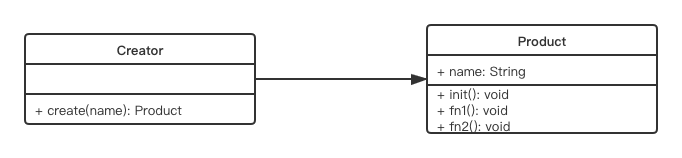

## 4. 介绍23种设计模式  
### 4-1. 创建型  
* [工厂模式（工厂方法模式、抽象工厂模式、建造者模式）](#工厂模式)  
* 单例模式  
* 原型模式  

### 4-2. 结构型  
* 适配器模式****  
* 装饰器模式****  
* 代理模式****  
* 外观模式****  
* 桥接模式  
* 组合模式  
* 享元模式

### 4-3. 行为型  
* 策略模式  
* 模版方法模式  
* 观察者模式****  
* 迭代器模式****  
* 职责连模式  
* 命令模式  
* 备忘录模式  
* 状态模式****  
* 访问者模式  
* 中介者模式  
* 解释器模式  

*** 
## 工厂模式  
* 将new操作单独封装  
* 示例： 购买汉堡，直接点餐，取餐，不用考虑怎么做汉堡（商店要封装‘做汉堡’的工作）  
* UML类图  

