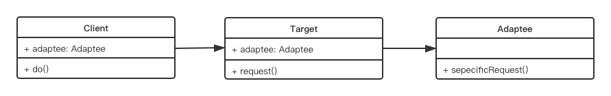
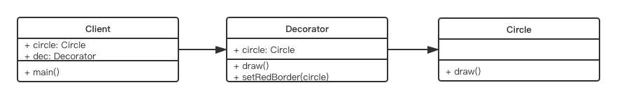
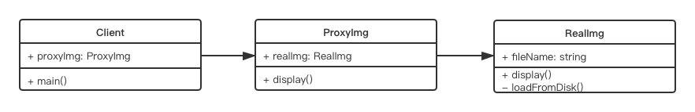
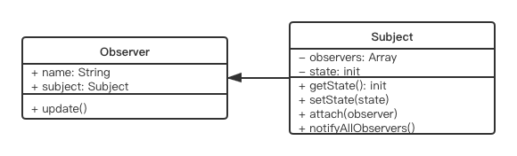

## 4. 介绍23种设计模式  
### 4-1. 创建型  
* [工厂模式（工厂方法模式、抽象工厂模式、建造者模式）](#工厂模式)  
* [单例模式](#单例模式)  
* 原型模式  

### 4-2. 结构型  
* [适配器模式**** ](#适配器模式)  
* [装饰器模式**** ](#装饰器模式)  
* [代理模式****  ](#代理模式)  
* 外观模式****  
* 桥接模式  
* 组合模式  
* 享元模式

### 4-3. 行为型  
* 策略模式  
* 模版方法模式  
* [观察者模式****  ](#观察者模式)  
* 迭代器模式****  
* 职责连模式  
* 命令模式  
* 备忘录模式  
* 状态模式****  
* 访问者模式  
* 中介者模式  
* 解释器模式  

*** 
## 工厂模式  
1. 概念：将new操作单独封装  
2. 示例：购买汉堡，直接点餐，取餐，不用考虑怎么做汉堡（商店要封装‘做汉堡’的工作）  
3. UML类图  
  
4. 场景  
4-1. jQuery - $('div')  
4-2. React.createElement  
4-3. vue异步组件  
5. 代码演示：  
```  
class Product {  
  constructor(name){  
    this.name = name
  }  
  init() {  
    console.log('init')  
  }  
}  
class Creator{  
  create(name){  
    return new Product(name)
  }  
}  
let creator =  new Creator()  
let p = creator.create('p1')  
p.init()  
```  
6. 设计原则验证  
* 构造函数和创建者分离  
* 符合开放封闭原则  
***  
## 单例模式    
1. 介绍  
1-1. 系统中被唯一使用  
1-2. 一个类只有一个实例  
2. 说明  
2-1. 单例模式需要使用java的特性（private)  
2-2. ES6中没有（typescript除外）  
2-3. 只能用java代码来演示UML图的内容  
3. 代码演示：(js没有private，所以直接执行new SingleObject也不报错)  
```  
class SingleObject{  
  login(){  
    console.log('login...')  
  }  
}  
SingleObject.getInstance = (function(){  
  let instance
  return function(){  
    if(!instance){  
      instance = new SingleObject()  
    }  
    return instance  
  }  
})()  
let obj1 = SingleObject.getInstance()  
obj1.login()  
let obj2 = SingleObject.getInstance()  
obj2.login()  
```  
4. 场景  
4-1. jQuery只有一个$   
4-2. 模拟登录框/购物车    
4-3. vuex redux - store  

***  
## 适配器模式  
1. 介绍  
* 旧接口格式和使用者不兼容  
* 中间加一个适配转换接口  
2. 示例： 插排接口转换器  
3. UML类图  
  
4. 代码演示  
```  
class Adaptee{  
  specificRequest(){  
    return '德国标准插头'  
  }  
}  
class Target{  
  constructor(){  
    this.adaptee = new Adaptee()
  }  
  request(){  
    let info = this.daptee.specificRequest()
    return info + '转换器 - 中国标准插头'
  }  
}  
let target = new Target()  
target.request()  
```  

5. 场景  
* 封装旧接口  
* vue computed  

***  
## 装饰器模式  
1. 介绍  
* 为对象添加新功能  
* 不改变其原有的结构和功能  
2. 示例：手机壳-手机  
3. UML类图  
  
4. 代码演示  
```  
class Circle{  
  draw(){  
    console.log('画一个圆形')
  }  
}  
class Decorator{  
  constructor(circle){  
    this.circle = circle  
  }  
  draw(){  
    this.circle.draw()  
    this.setRedBorder(circle)  
  }  
  setRedBorder(circle){  
    console.log('设置红色框')
  }  
}  
let circle = new Circle()  
circle.draw()  

let dec = new Decorator(circle)  
dec.draw()  
```  
5. 场景  
5-1. ES7装饰器  
* 装饰类  
```  
@testDec  
class Demo{  
}  
function testDec(target){  
  target.isDec = true;  
}  
alert(Demo.isDec)// true  

//装饰器原理  
@decorator  
class A {}  

//等同于  
class A {}  
A = decorator(A)||A  

// mixins  
function mixins(...list){  
  return function(target){  
    Object.assign(target.prototype,...list)
  }  
}  

const Foo = {  
  foo(){  
    alert('foo')  
  }  
}  
@mixins(Foo)  
class MyClass{  
}  

let obj = new MyClass()  
obj.foo()  
```  
* 装饰方法（@readonly,@log）  
```  
//@readonly  
function readonly(target,name,descriptor){  
  descriptor.writable = false  
  return descriptor
}  

class Person{  
  constructor(){  
    this.first = 'Chen'    
    this.last = 'Han'  
  }  
  
  @readonly
  name(){  
    return this.first+this.last  
  }  
}  
let p = new Person()  
console.log(p.name())  

```  
```  
//@log  
function log(target, name, descriptor){  
  let oldValue = descriptor.value  
  descriptor.value = function(){  
    console.log('calling'. arguments)  
    return oldValue.apply(this, arguments)  
  }  
  return descriptor  
}  

class Math {  
  @log  
  add(a,b){  
     return a + b  
  }  
}  

let math  = new Math()  
const result = math.add(2,4)  
console.log('result', result)  

```  

5-2. core-decorators  
``` 装饰器不能用于函数（函数提升）```   

***  
## 代理模式  
1. 示例（科学上网，明星经纪人）  
2. UML类图  
  
3. 代码演示  
```  
class ReadImg{  
  constructor(fileName){  
   this.fileName = fileName
   this.loadFromDisk()//初始化即从硬盘中加载，模拟  
  }  
  display(){  
    console.log('display')
  }  
  loadFromDisk(){  
    console.log('loadFromDisk')
  }  
}  
class ProxyImg{  
  constructor(fileName){  
    this.realImg = new ReadImg(fileName)
  }  
  display(){  
    this.realImg.display()
  }  
}  

```  
4. 场景  
* 事件代理和jq的$.proxy  
* 明星经纪人（ES6-proxy  
```  
代理模式VS适配器模式  
* 适配器模式：提供一个不同的接口（如不同版本的插头  
* 代理模式：提供一摸一样的接口  
```  

```  
代理模式VS装饰器模式  
* 装饰器模式：扩展功能，原有功能不变且可直接使用    
* 代理模式：显示原有功能，但是经过限制或者阉割之后的  
```   

***  
## 观察者模式  
1. 介绍  
* 发布/订阅  
* 一对多  
2. UML类图  
  
```  
// 主题，保存状态，状态变化之后触发所有观察者对象  
class Subject{  
  constructor(){  
    this.state=0  
    this.observers = []  
  }  
  getState(){  
    return this.state  
  }  
  setState(state){  
    this.state = state  
    this.notifyAllObservers()  
  }  
  notifyAllObservers(){  
    this.observers.forEach(observers=>{  
      observer.update()
    })  
  }  
  attach(observer){  
    this.observers.push(observer)  
  }  
}  

//观察者  
class Observer{  
  constructor(name,subject){  
    this.name = name  
    this.subject = subject  
    this.subject.attach(this)  
  }  
  update(){  
    console.log(update)
  }  
}  

let s = new Subject()  
let 01 = new Observer('01', s)

s.setState(1)

```  
3. 场景  
* 网页事件绑定  
* Promise  
* jQuery callbacks  
* nodejs 自定义事件（on emit/readstream） 
* 其他场景（nodejs:处理http请求；多进程通讯，vue和react组件生命周期触发，vue watch...）  


